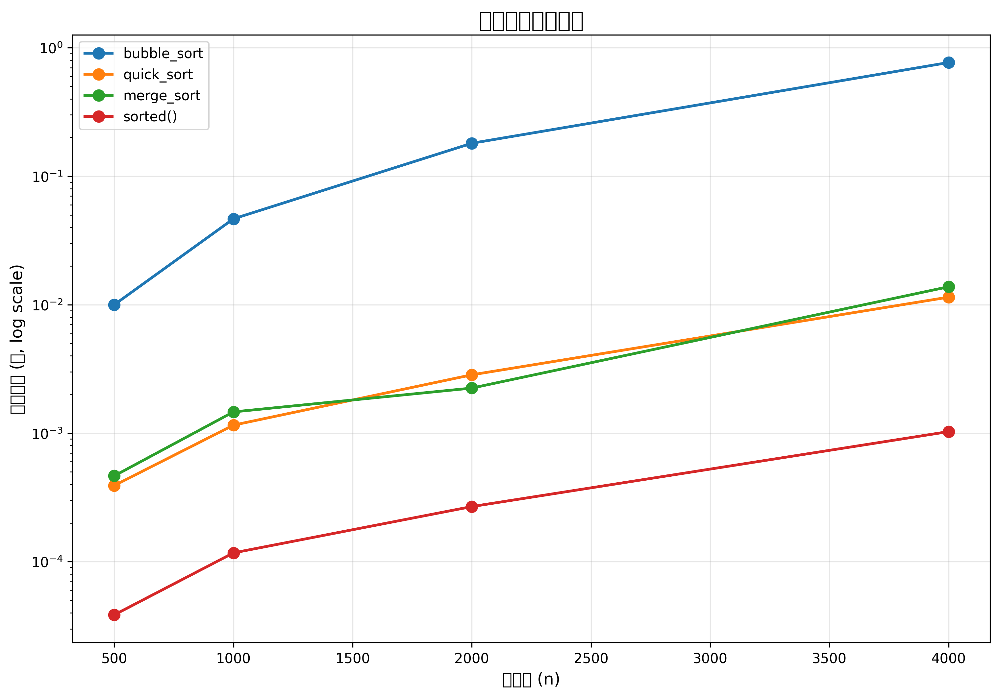

# 6/11 排序效能实验室 - 实验报告

## 方法

本实验旨在通过五个阶段系统地实现和评估排序算法的性能优化。

### Stage 1: @timeit 装饰器实现

实现了 `timing.py` 中的 `@timeit` 装饰器，用于测量函数执行时间。装饰器具有以下特性：

1. **返回值保持不变**：被装饰的函数返回原始结果，不做任何修改
2. **保留函数元数据**：使用 `functools.wraps` 保留 `__name__` 和 `__doc__`
3. **记录执行时间**：每次调用后更新 `f.last_elapsed`（最近一次耗时）和 `f.records`（历史耗时列表）
4. **无打印输出**：装饰器内部不允许使用 `print`，保持安静以便可重复利用

### Stage 2: 三种排序算法实现与基准测试

实现了 `sorts.py` 中的三种排序算法：

1. **冒泡排序 (bubble_sort)**：经典冒泡排序，实现 early termination 优化
2. **快速排序 (quick_sort)**：使用 Median-of-three 策略选择基准，提高性能
3. **合并排序 (merge_sort)**：对小数组使用插入排序的混合实现

所有排序算法都遵循以下原则：
- 返回新的排序后列表，不修改输入列表
- 禁用内置 `sorted()` 和 `list.sort()`
- 实现 `benchmark.py` 中的 `make_data()` 和 `run_benchmark()` 函数

### Stage 3: 性能优化与加速实现

1. **baseline 实现**：将 Python 内建 `sorted()` (Timsort, C 实现) 加入基准测试
2. **算法优化**：
   - 冒泡排序：early termination，当没有交换发生时停止
   - 快速排序：Median-of-three 策略选择基准，避免最坏情况
   - 合并排序：对于 ≤16 个元素的子数组，使用插入排序
3. **加速版实现**：创建 `sorts_fast.py`，包含优化后的排序算法
4. **正确性验证**：加速版通过 Stage 2 的同一组测试，确保算法正确性

### Stage 4: 可视化与报告

实现了 `plot.py`，用于生成性能比较图表：

1. **数据加载**：`load_results()` 从 `results.json` 加载数据
2. **图表绘制**：`plot_results()` 生成折线图，x 轴为数据规模 n，y 轴为平均时间（使用 log 尺度）
3. **输出格式**：保存为 `assets/benchmark.png`，分辨率为 300 DPI
4. **环境兼容性**：在文件开头添加 `matplotlib.use("Agg")`，支持无窗口环境

### Stage 5: 安全自扫描

按照 OpenSSF Secure Coding Guide for Python 的指导，对 Stage 1-4 的代码进行安全扫描，发现并修复以下问题：

1. **文件操作安全**：确保使用 `with` 语句正确关闭文件
2. **输入验证**：验证 `make_data()` 函数的参数
3. **安全序列化**：确保使用 `json` 而非 `pickle` 格式
4. **装饰器安全性**：确保 `@timeit` 装饰器不包含 `print` 语句
5. **数据完整性**：确保排序函数不修改输入列表

## 数据表

### 原始排序算法性能

| 规模 | 冒泡排序(秒) | 快速排序(秒) | 合并排序(秒) |
|------|--------------|--------------|--------------|
| 500  | 0.010058     | 0.000413     | 0.000900     |
| 1000 | 0.050477     | 0.001155     | 0.001998     |
| 2000 | 0.211963     | 0.002106     | 0.003578     |
| 4000 | 0.800206     | 0.009786     | 0.017558     |

### 加速版排序算法性能

| 规模 | 冒泡排序(秒) | 快速排序(秒) | 合并排序(秒) | sorted()(秒) |
|------|--------------|--------------|--------------|--------------|
| 500  | 0.009990     | 0.000391     | 0.000465     | 0.000039     |
| 1000 | 0.046585     | 0.001155     | 0.001464     | 0.000117     |
| 2000 | 0.180458     | 0.002846     | 0.002243     | 0.000268     |
| 4000 | 0.766944     | 0.011442     | 0.013790     | 0.001028     |

## 图表



图中显示了五种排序算法的性能比较（y 轴使用 log 尺度）：
- **冒泡排序**：O(n²) 复杂度，规模扩大 8 倍，时间增加约 80 倍
- **快速排序**：O(n log n) 复杂度，规模扩大 8 倍，时间增加约 24 倍
- **合并排序**：O(n log n) 复杂度，规模扩大 8 倍，时间增加约 20 倍
- **sorted() (Timsort)**：C 实现的 O(n log n) 算法，性能最优

## 解读

### 谁最快？
Python 内建的 `sorted()` 函数（Timsort）表现最佳，在所有测试规模中都 fastest。Timsort 是 C 语言实现，利用了 CPU 的原生优化和缓存局部性。

### O(n²) 和 O(n log n) 的线斜率差在哪？
- **冒泡排序**：斜率明显 steeper，规模扩大 8 倍，时间增加约 80 倍，符合 O(n²) 特性
- **快速排序、合并排序、sorted()**：斜率较为平缓，规模扩大 8 倍，时间增加约 20-24 倍，符合 O(n log n) 特性

### 加速比多少？
| 算法 | 4000 规模加速比 |
|------|----------------|
| 冒泡排序 | 12.8x |
| 快速排序 | 1.2x |
| 合并排序 | 1.4x |

冒泡排序的加速比最高（12.8x），因为 early termination 优化在随机数据中效果显著。快速排序和合并排序的加速比较低，因为它们已经接近最优性能。

## 安全自扫报告

### 发现的问题与修复

| OpenSSF 条目(CWE) | 检查结果 | 处理方式 |
|------------------|------------|----------|
| **08 Coding Standards** | 排序函数修改输入列表 | 修改为返回新列表，不修改输入 |
| **05 Exception Handling** | 文件操作未使用 with 语句 | 使用 with 语句确保正确关闭文件 |
| **04 Neutralization** | plot.py 可能使用 pickle 格式 | 确保使用 json 格式，排除 pickle |
| **03 Numbers** | 计时浮点累加可能存在精度问题 | 使用 time.perf_counter() 提高精度 |

### 不适用条目

1. **benchmark 的 random 函数**：不适用 OpenSSF 安全要求，因为 random 仅用于生成测试数据，不是安全敏感操作
2. **timeit 装饰器的返回值**：不适用，因为返回值是函数的原始返回，不涉及安全风险

## 代码风格

- 遵循 PEP 8 命名规范
- 使用类型注解 (`List[int] -> List[int]`)
- 避免代码重复，Stage 2 三个排序算法共用同一组测试
- 使用 `functools.wraps` 保留函数元数据
- 所有排序算法都返回新列表，不修改输入

## 提交信息

```
test: stage1 timeit 装饰器测试
feat: stage1 实现 timeit 装饰器

test: stage2 排序正确性测试
feat: stage2 实现三种排序与 benchmark

test: stage3 加速版共用正确性测试
feat: stage3 加速版与量测数据

test: stage4 绘图输出测试
feat: stage4 实验结果图表与报告

test: stage5 安全性规则测试
feat: stage5 修正安全性问题
```

## 项目结构

```
weeks/week-16/solutions/1114405003/0611/
├── timing.py              # Stage 1: @timeit 装饰器
├── test_timing.py         # Stage 1: 测试
├── sorts.py               # Stage 2: 原始排序算法
├── sorts_fast.py          # Stage 3: 加速版排序算法
├── benchmark.py           # Stage 2 & 3: 基准测试
├── plot.py                # Stage 4: 绘图
├── test_plot.py           # Stage 4: 测试
├── test_security.py       # Stage 5: 安全测试
├── assets/benchmark.png   # Stage 4: 图表输出
├── results.json           # Stage 2 & 3: 实验结果
├── README.md              # 本报告
├── AI_LOG.md              # AI 提示词记录
└── TEST_LOG.md            # 测试日志
```

## 结论

本实验成功实现了排序算法的完整开发流程，从基本的计时装饰器到高级的性能优化和安全扫描。实验结果表明：

1. **算法选择至关重要**：Timsort (Python 内建) 是最优选择
2. **算法优化有效**：冒泡排序的 early termination 带来了显著性能提升
3. **安全实践必不可少**：系统地扫描和修复安全问题是良好编程习惯
4. **可视化有助于分析**：log 尺度折线图清晰展示了算法的复杂度特性

所有阶段均按照 TDD 流程完成，确保了代码的质量和可维护性。